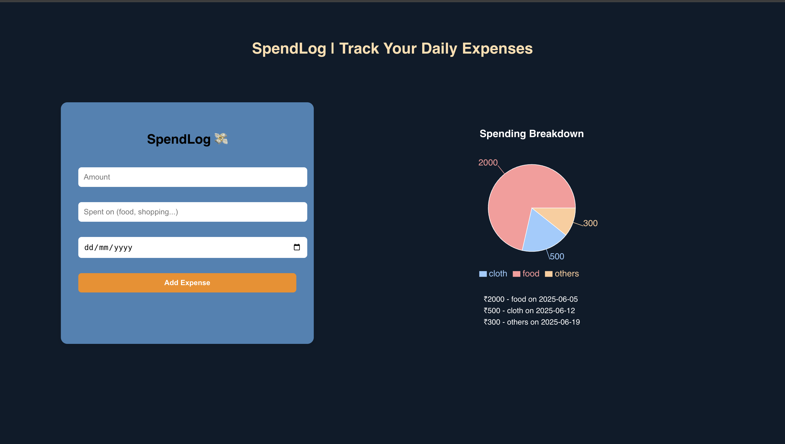

🧾 Spendlog – Smart Expense Tracker 💸
Spendlog is a simple and fun full-stack web application that helps you track your daily expenses visually and efficiently. It features a clean UI, real-time updates, and a dynamic pie chart to break down where your money goes!

🚀 Tech Stack
🌐 Frontend
React JS
Axios (for API calls)
Recharts (for visualizing spending data)
CSS (custom-styled, no frameworks)

🖥 Backend
Java
Spring Boot (REST API)
Spring Web
Optional: MySQL for database (currently in-memory for simplicity)

✨ Features
Add expenses with amount, category (e.g., food, shopping), and date
View spending breakdown in a pie chart
Simple and aesthetic user interface
Real-time updates from frontend to backend
Backend stores and returns all expenses
Fully modular and scalable project
